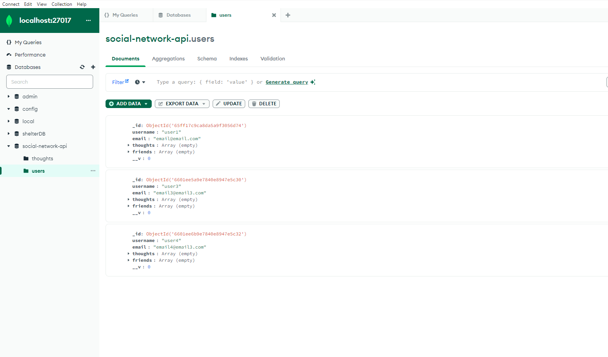
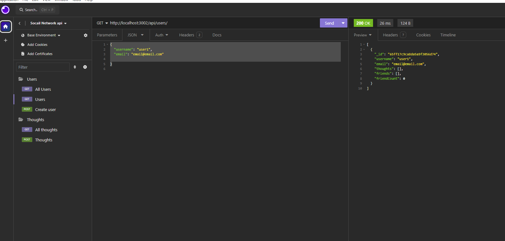

# social-network-api

https://github.com/imbanu1/social-network-api
https://www.loom.com/share/3c97d5f3accf4e41a8227ee0eea362ee?sid=644c77d6-c020-4be9-bee7-c43158f0f613

AS A social media startup
I WANT an API for my social network that uses a NoSQL database

SO THAT my website can handle large amounts of unstructured data
GIVEN a social network API
WHEN I enter the command to invoke the application
THEN my server is started and the Mongoose models are synced to the MongoDB database

WHEN I open API GET routes in Insomnia for users and thoughts
THEN the data for each of these routes is displayed in a formatted JSON

WHEN I test API POST, PUT, and DELETE routes in Insomnia
THEN I am able to successfully create, update, and delete users and thoughts in my database
